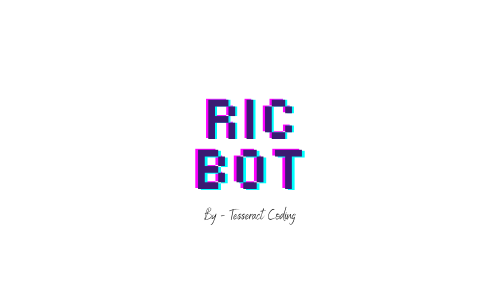

This is a Discord bot that we are building for our Discord Guild and the main
aim for this bot is going to help us manage the server in a better way. 

The intentional and first initial Goals of the Bot would be 

1. List our Upcoming events.
2. Share our Tweets to the guild.
3. Share memes from random subreddits. 

The other more complex goals for this bot would be 

1. Prevent Spamming
2. Answer Peoples Questions [can be thought of as a QnA bot].
3. Personalized Team messages. [like a custom message from our team members 
when their name is mentioned after our prefix].

I intend to make this as modular as possible to make it easier to maintain 
and keep updated moving along further.

You are free to clone this repository and make changes to it to deploy it to 
your own guild.